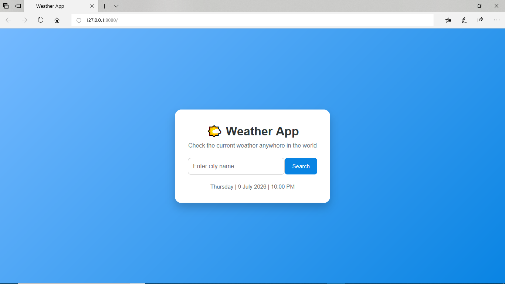
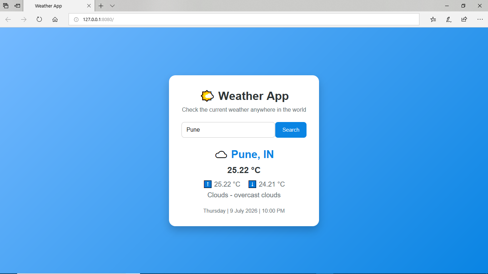
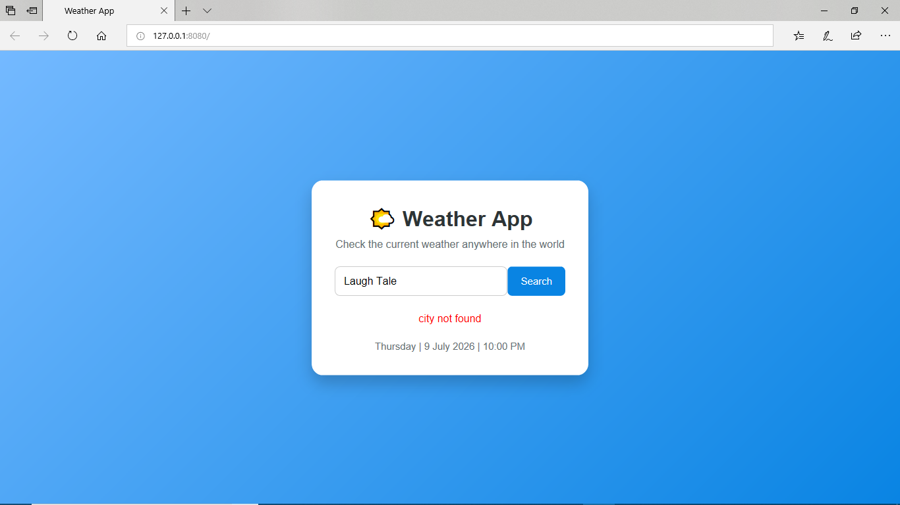

# 🌦️ Weather App using JavaScript (ES6)


A weather application built using **JavaScript ES6 modules** that fetches weather information either from the **OpenWeather API** or a JSON file for local testing. The project demonstrates modern JavaScript concepts such as modules, asynchronous programming, API integration, and DOM manipulation.

---

## ✨ Features

- Search weather by city name
- Fetch real-time weather data from the OpenWeather API
- Supports two data sources:
  - Local JSON (development/testing)
  - OpenWeather API (live weather)
- Displays:
  - Current temperature
  - Minimum and maximum temperature
  - Weather condition
  - Country
- Displays current date and time
- Easily switch between mock and live API data
-The application displays appropriate error messages when:
  - The city name is invalid
  - The weather service returns an error
  - API requests fail

---

## 🛠️ Tech Stack

| Category | Technology |
|----------|------------|
| Frontend | HTML5, CSS3 |
| Language | JavaScript (ES6 Modules) |
| HTTP | Fetch API |
| External API | OpenWeather API |
| Package Manager | npm |
| Development Server | live-server |

---

## 📁 Project Structure

```text
WeatherApp-Using-Javascript/
├── index.html
├── styles.css
├── app.js
├── api.js
├── config.js
├── mock.json
├── package.json
├── package-lock.json
├── .gitignore
└── README.md
```

---

## 🧠 Concepts Demonstrated

- ES6 Modules (`import` / `export`)
- Fetch API
- Asynchronous programming with `async/await`
- DOM manipulation
- JSON parsing
- Error handling
- API integration
- Configuration-based environment switching

---

## ⚙️ Getting Started

### Prerequisites

- Node.js (v14 or later)
- npm

Verify your installation:

```bash
node -v
npm -v
```

### Clone the Repository

```bash
git clone https://github.com/Atharva-Shelke/WeatherApp-Using-Javascript.git
```

### Install Dependencies

```bash
npm install
```

### Run the Application

```bash
npm start
```
The application is served using **live-server**, allowing ES6 modules and local JSON files to be loaded correctly.

Open your browser and navigate to:

```text
http://localhost:8080
```

## 🔄 Application Modes

### 💻 Local Mode

Configure in `config.js`:

Uses the local `mock.json` file instead of calling the OpenWeather API.

In `config.js`:

```javascript
USE_LOCAL: true
```

This mode:

- Does not require an internet connection
- Is useful for testing and development

### 🌐 Live Mode

Fetches real-time weather data from the OpenWeather API.

In `config.js`:

```javascript
USE_LOCAL: false
```

This mode requires an active internet connection.

**Note:** The API key is stored in the frontend for demonstration purposes. In a production application, it should be secured using environment variables or a backend service.

---

## 📸 Screenshots

### Weather Search



### Weather Result



### Invalid City



---

## 📚 Key Concepts Demonstrated

- Building applications with ES6 Modules
- Integrating third-party REST APIs
- Using the Fetch API with `async/await`
- Handling asynchronous operations
- Manipulating the DOM dynamically
- Working with JSON data
- Managing configuration for multiple environments

